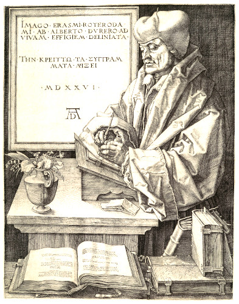

Auctores
========

 

[LÉAME en español](README.es.md)

**This is an art project**. What if classical authors had written their masterpieces by pushing commits to a Git repository.

Requirements
------------

- Linux or macOS (it might work on Windows using WSL2 or MSYS2; don’t ask me about it)
- GNU `bash`, `make` and `date`

NOTE: On macOS you must install the GNU coreutils, make and Bash using [Homebrew](https://brew.sh):

```sh
brew install coreutils
brew install bash
brew install make
```

Configuration
-------------

Copy `auctoresrc.exemplum` to `.auctoresrc` and edit the latter.

Running the project
-------------------

Run the preliminaries:

```sh
make anterem
```

If your environment supports cron, you can install a cronjob using:

```sh
make scribire
```

The cronjob will (occasionally) write to the output directory (by default `./exitum`) following a pseudo-random pattern.

Or you can just manually run `./bin/scribere` from time to time.

Text corpus
-----------

- “El ingenioso hidalgo don Quijote de la Mancha” de Miguel de Cervantes Saavedra
- “The Merchant of Venice”  by William Shakespeare
- „Faust: Der Tragödie (erster und zweiter Teilen)” von Johann Wolfgang von Goethe

Original texts from Project Gutenberg. These eBooks are for the use of anyone anywhere at no cost and with almost no restrictions whatsoever.  You may copy it, give it away or re-use it under the terms of the [Project Gutenberg License](corpus/LICENSE) included with this eBook or online at [Project Gutenberg](https://www.gutenberg.net]).
